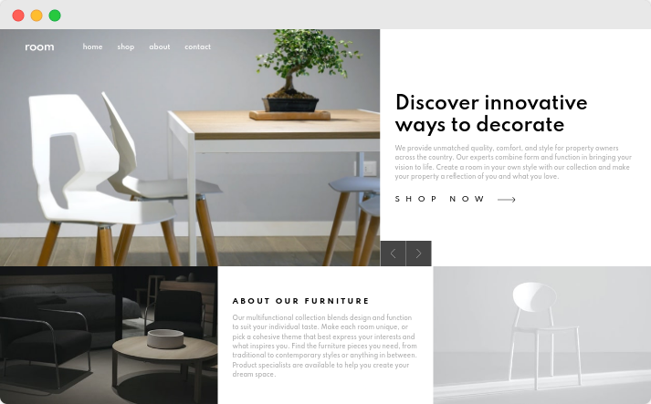
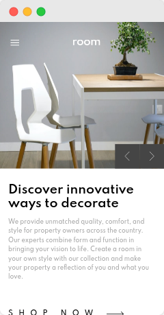

# Frontend Mentor - Room homepage solution

This is a solution to the [Room homepage challenge on Frontend Mentor](https://www.frontendmentor.io/challenges/room-homepage-BtdBY_ENq). Frontend Mentor challenges help you improve your coding skills by building realistic projects. 

## Table of contents

- [Frontend Mentor - Room homepage solution](#frontend-mentor---room-homepage-solution)
  - [Table of contents](#table-of-contents)
  - [Overview](#overview)
    - [The challenge](#the-challenge)
    - [Screenshot](#screenshot)
    - [Links](#links)
    - [Built with/](#built-with)
  - [Author](#author)

## Overview

### The challenge

Users should be able to:

- View the optimal layout for the site depending on their device's screen size
- See hover states for all interactive elements on the page
- Navigate the slider using either their mouse/trackpad or keyboard

### Screenshot  

### Links

- Solution URL: https://github.com/rndy28/room-homage-landing-page
- Live Site URL: https://prismatic-yeot-0156a4.netlify.app/
### Built with/

- Semantic HTML5 markup
- BEM naming convention
- SCSS
- Flexbox
- Mobile-first workflow
## Author
- Frontend Mentor - [@rndy28](https://www.frontendmentor.io/profile/rndy28)
- Twitter - [@rndyramadhan28](https://www.twitter.com/rndyramadhan28)

